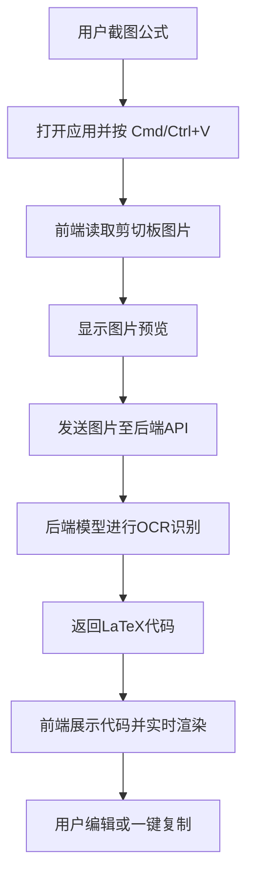

## 1. 产品概述
这是一款旨在将公式图片快速转换为 LaTeX 代码的 Web 应用程序。
- 用户可以直接通过剪切板粘贴图片，应用会自动提取公式图片并将其转换为 LaTeX 指令，极大提升学术写作、论文排版和笔记整理的效率。
- 提供直观的图片预览、LaTeX 代码编辑以及实时的公式渲染预览功能。

## 2. 核心功能

### 2.1 用户角色
| 角色 | 注册方式 | 核心权限 |
|------|---------------------|------------------|
| 普通用户 | 无需注册，本地使用 | 上传/粘贴图片进行识别，复制 LaTeX 结果 |

### 2.2 功能模块
1. **主页**: 剪贴板监听与上传区、图片预览区、LaTeX 结果展示与编辑区、实时公式渲染预览区。
2. **设置侧边栏**: 用于配置后端 API 地址或本地识别模型选项。

### 2.3 页面详情
| 页面名称 | 模块名称 | 功能描述 |
|-----------|-------------|---------------------|
| 主页 | 顶部导航栏 | 显示 Logo 及应用名称，包含主题切换按钮（暗色/亮色） |
| 主页 | 图片输入区 | 监听全局 `Ctrl+V` / `Cmd+V`，支持点击上传或拖拽图片。在空状态下显示明确的引导提示。 |
| 主页 | 识别结果区 | 显示识别出的 LaTeX 代码，提供一键复制按钮，支持手动编辑和修正代码。 |
| 主页 | 实时渲染区 | 根据用户编辑的 LaTeX 代码实时渲染出数学公式，便于验证识别结果的准确性。 |

## 3. 核心流程
用户通过截图工具截取公式图片，然后直接在浏览器中打开应用并按下粘贴快捷键。前端读取剪切板中的图片并展示预览，随后将图片数据发送给后端接口。后端调用 AI 模型（如 LaTeX-OCR / pix2tex）进行识别，将结果返回前端。前端显示 LaTeX 代码，并实时渲染出对应的数学公式，最后用户一键复制代码。

## 4. 用户界面设计
### 4.1 设计风格
- 整体风格：极致的极简主义（Minimalist & Refined），结合现代科技感。
- 主题颜色：以深色模式（Dark Theme）为主，深灰黑背景（如 `#121212`），强调色使用带有未来感的荧光蓝或紫（如 `#6366f1`）。
- 排版字体：标题使用极具个性的字体（如 `Outfit` 或 `Space Grotesk` 的替代设计），代码区域使用 `JetBrains Mono` 或 `Fira Code`。
- 交互动效：使用细腻的过渡动画，在图片粘贴、识别加载、代码生成时提供流畅的微交互（如光效扫过或打字机效果）。
- 空间布局：大面积留白，卡片使用毛玻璃效果（Glassmorphism）和微妙的边框高光，脱离传统的死板网格。

### 4.2 页面设计概述
| 页面名称 | 模块名称 | UI 元素 |
|-----------|-------------|-------------|
| 主页 | 核心工作区 | 左右分栏或上下卡片布局，左侧为带虚线的拖拽/粘贴区域，右侧上方为代码编辑器（带高亮），右侧下方为公式渲染结果。按钮采用带有微妙光晕的扁平设计。 |
| 主页 | 状态提示 | 加载时显示优雅的骨架屏或脉冲动画，成功/失败时显示精致的 Toast 提示。 |

### 4.3 响应式设计
桌面端优先设计（Desktop-first），完美适配宽屏显示器，利用大屏优势平行展示图片与代码。移动端自动折叠为上下堆叠布局，优化触摸区域。
