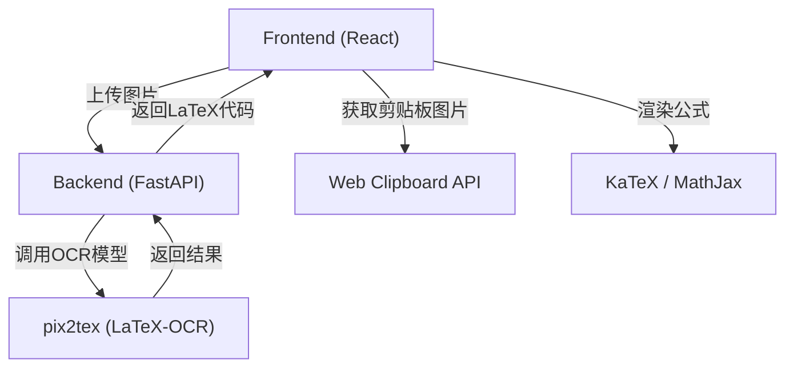

## 1. 架构设计


## 2. 技术说明
- **Frontend (前端)**: React@18 + Vite + Tailwind CSS@3
- **Frontend Dependencies**: 
  - `react-use`: 用于剪贴板、键盘事件监听。
  - `lucide-react`: 精致的图标库。
  - `framer-motion`: 实现细腻的过渡动画和微交互。
  - `react-katex` 或 `katex`: 渲染数学公式的库。
  - `sonner` 或 `react-hot-toast`: 用于优美的全局通知。
- **Backend (后端)**: Python 3 + FastAPI + Uvicorn
- **Backend Dependencies**: 
  - `pix2tex` (`LaTeX-OCR`): 核心 OCR 模型，能够将图片转为 LaTeX。
  - `Pillow` (PIL): 图片处理。
  - `python-multipart`: 处理上传的文件。

## 3. 路由定义
| 路由 | 目的 |
|-------|---------|
| `/` | 应用程序的主页，负责图片输入、预览、代码编辑和公式渲染 |

## 4. API 定义
### 4.1 `/api/recognize`
**Method**: `POST`
**Request Headers**:
```http
Content-Type: multipart/form-data
```
**Request Body**:
- `file`: 包含图片数据的 FormData 字段 (支持 `image/png`, `image/jpeg` 等格式)。

**Response**:
```json
{
  "status": "success",
  "latex": "\\sum_{i=1}^{n} x_i",
  "confidence": 0.95
}
```

## 5. 服务器架构图


## 6. 数据模型
本应用属于无状态服务（Stateless Service），不涉及数据库持久化存储。用户上传的图片在内存中处理后直接返回结果，不会在服务器端进行长期保存。前端通过 `localStorage` 缓存最近识别的历史记录和用户设置（如 API 地址或本地偏好设置）。
